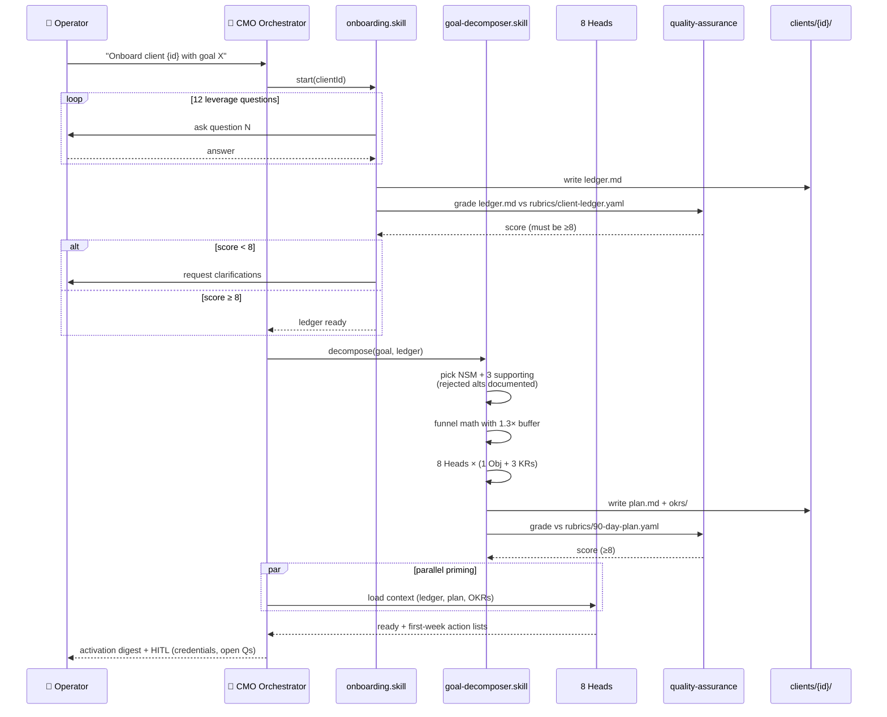
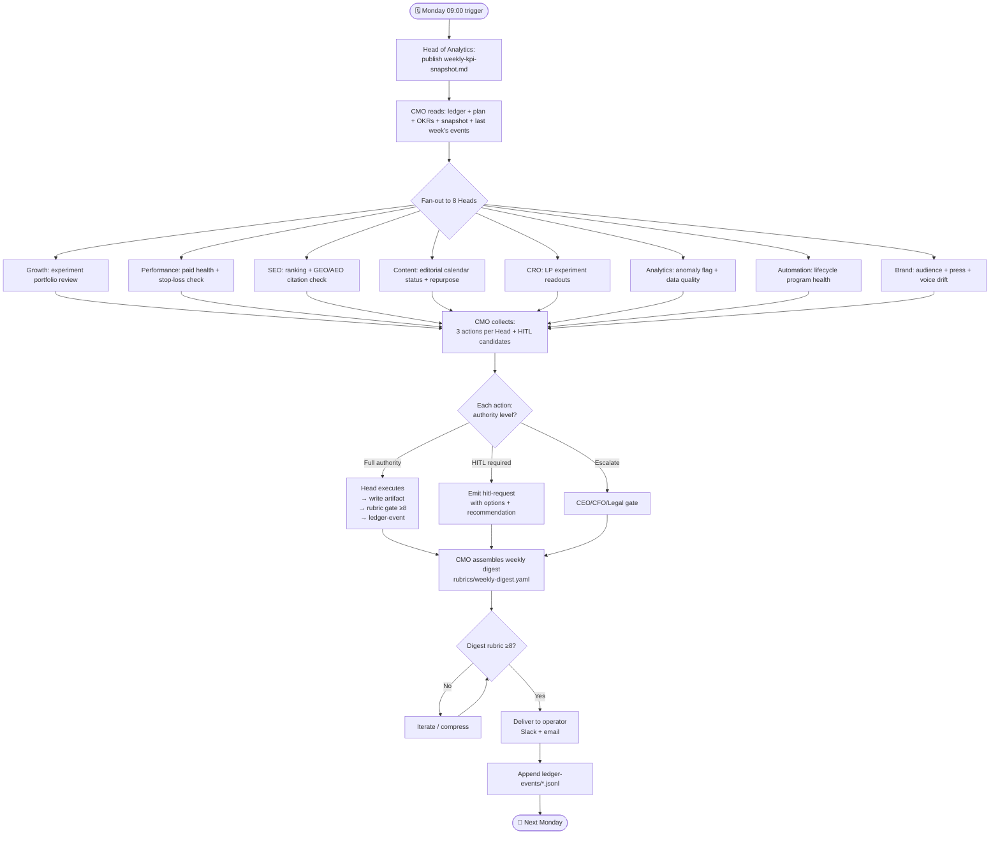
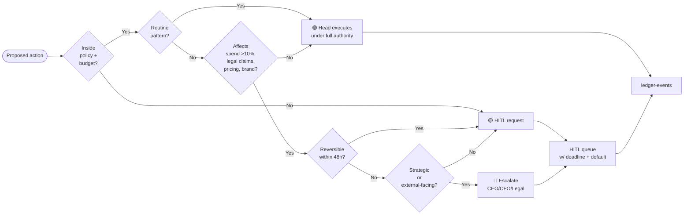
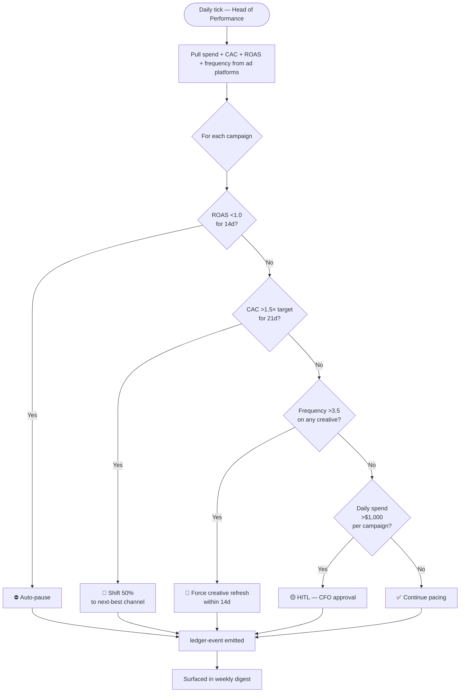
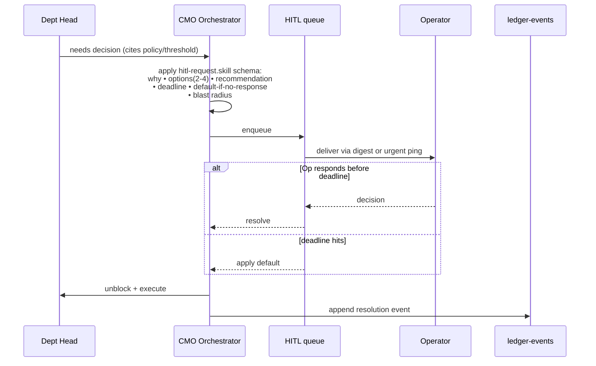

# Execution Flows

Mermaid diagrams (GitHub renders natively). Covers: system map, onboarding, weekly loop, per-artifact production, decision authority, stop-loss, and escalation.

---

## 1. System Map — who talks to what

```mermaid
flowchart TB
    Operator([👤 Operator / VP Marketing])
    CMO[🎯 CMO Orchestrator<br/>.claude/agents/cmo-orchestrator.md]

    subgraph Heads[8 Department Heads]
      direction LR
      HG[Head of Growth]
      HP[Head of Performance]
      HS[Head of SEO/GEO/AEO]
      HC[Head of Content]
      HCR[Head of CRO]
      HA[Head of Analytics]
      HAU[Head of Automation]
      HB[Head of Brand]
    end

    Skills[(146 canonical skills<br/>+ 4 orchestration skills)]
    Rubrics[(19 rubrics<br/>pass bar 8)]
    Templates[(15 templates)]

    subgraph Client[clients/{id}/]
      Ledger[ledger.md]
      Plan[plan.md + okrs/]
      Feeds[feeds/weekly-kpi-snapshot.md]
      Artifacts[campaigns/ · emails/ · ads/<br/>seo-cluster/ · battlecards/ · content/]
      Events[(ledger-events/*.jsonl<br/>append-only)]
    end

    Vault[🔐 Secret vault<br/>1Password/Doppler]

    Operator -- goal / HITL answers --> CMO
    CMO -- delegate --> Heads
    Heads -- invoke --> Skills
    Skills -- use --> Templates
    Skills -- emit --> Artifacts
    Artifacts -- gated by --> Rubrics
    Heads -- read --> Ledger
    Heads -- read --> Plan
    HA -- publishes --> Feeds
    Heads -- read --> Feeds
    CMO -- reads all --> Client
    CMO -- writes --> Events
    Heads -- pointer-only --> Vault
    CMO -- weekly digest --> Operator
    CMO -. HITL when needed .-> Operator
```

---

## 2. Onboarding → Activation (one-time per client)



---

## 3. Weekly Execution Loop (recurring, Monday cadence)



---

## 4. Per-Artifact Production + Rubric Gate

```mermaid
stateDiagram-v2
    [*] --> Brief: Head receives brief
    Brief --> Draft: invoke skill<br/>(uses template + context)
    Draft --> BrandGate: brand-voice.yaml check
    BrandGate --> Rework1: score <8
    Rework1 --> Draft
    BrandGate --> SpecificGate: score ≥8

    SpecificGate: Artifact-specific rubric<br/>(e.g., ad-copy / seo-brief / campaign-brief)
    SpecificGate --> Rework2: score <8
    Rework2 --> Draft
    SpecificGate --> LegalGate: score ≥8

    LegalGate: Legal review?<br/>(only for regulated claims /<br/>competitor naming)
    LegalGate --> Hold: needs review
    Hold --> Legal[Legal sign-off]
    Legal --> LegalGate
    LegalGate --> CROGate: clean or N/A

    CROGate: CRO sign-off?<br/>(only for LPs / forms)
    CROGate --> DanaReview[Head of CRO approval]
    DanaReview --> CROGate
    CROGate --> Ship: clean or N/A

    Ship --> Event[append ledger-events/*.jsonl]
    Event --> Measure: wired to measurement plan
    Measure --> Review: review date (14/30/90d)
    Review --> Scale: ≥threshold
    Review --> Kill: <threshold
    Review --> Iterate2: inconclusive
    Scale --> [*]
    Kill --> [*]
    Iterate2 --> Draft
```

---

## 5. Decision Authority Matrix (who decides what)



Defaults encoded in `.claude/agents/cmo-orchestrator.md` and per-Head agent files. Thresholds from `clients/{id}/ledger.md §7` override global defaults.

---

## 6. Stop-Loss Enforcement (paid campaigns)



Thresholds live in each `campaigns/*.md` brief and in `.claude/agents/head-of-performance.md`. Customizable per client in `ledger.md`.

---

## 7. HITL (Human-In-The-Loop) Lifecycle



Constraints: ≤5 HITL items per weekly digest (more → compress with count). All HITL schema-compliant per `skills/orchestration/hitl-request.skill.md`.

---

## 8. When / What / How — at a glance

| When | Who triggers | What happens | Where it lands |
|---|---|---|---|
| New client | Operator invokes CMO | Onboarding skill (12 Qs) → ledger | `clients/{id}/ledger.md` |
| After ledger | CMO | Goal-decomposer → NSM, plan, OKRs | `plan.md`, `okrs/` |
| Every Monday 09:00 | Cron (Stage 4) or Operator | Weekly tick → snapshot → 8 Heads → digest | `feeds/`, digest, `ledger-events/` |
| Continuously | Head of Performance | Stop-loss checks on paid | auto-pause / reallocate / refresh |
| Any artifact shipped | Head via skill | Rubric gate (voice + specific + legal + CRO where applicable) | artifact file ends with `## Rubric Evaluation` |
| Decision outside authority | Head → CMO | HITL request schema → operator queue | digest + ledger-events |
| Experiment concludes | Head of Growth + owner | Readout + decision (ship/kill/iterate) | `experiments/{id}.md` |
| Quarter end | CMO | Monthly report aggregation + OKR grade | `feeds/monthly-*.md` |

---

## Notes
- Every arrow in these diagrams is a real file or a real skill invocation, not aspirational. Paths cited map to this repo.
- Stage 3 (MCP tool-calling) makes the "read from GA4 / write to Ads API" edges live — today those edges are specified, not wired. See `ROADMAP.md`.
- Stage 4 (autonomous scheduler) replaces "Operator triggers Monday" with a real cron.
